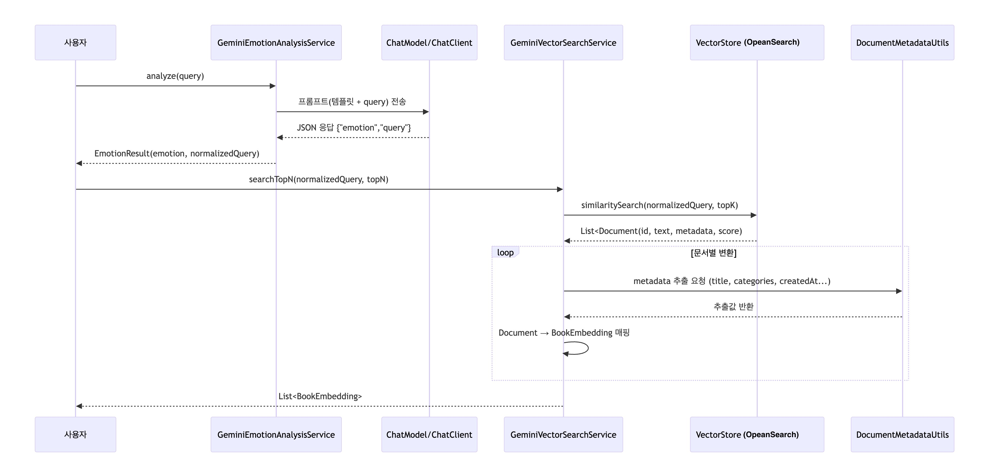

# Emotion-Aware Semantic Search Service

본 문서는 **Emotion-Aware Semantic Search Service**의 기술 아키텍처와 내부 동작을 개발자 관점에서 설명한다.  
본 시스템은 **LLM 기반 감정 분석, 벡터 유사도 검색, 감정 가중 재랭킹**을 결합한 검색 파이프라인을 제공한다.

---

## 1. Architectural Goals

- **의미 기반 검색 정확도 향상**
- **사용자 감정 맥락 반영**
- **검색 / 재랭킹 책임 분리**
- **LLM 의존 영역 최소화**
- **확장 가능한 점수 계산 구조**

---

## 2. System Architecture

### LLM 기반 사용자 질의 정규화 및 Vector DB 검색


> 사용자 질의를 LLM으로 감정 분석 및 의미적으로 정규화한 뒤, OpenSearch k-NN 기반 벡터 검색을 통해 상위 후보 문서를 조회한다. <br>
> 본 단계는 검색 대상 축소와 의미적 후보 선별을 책임진다.

### 벡터 검색 후보 문서 재평가 (Reranking)


> 벡터 검색으로 조회된 후보 문서들을 대상으로 감정 기반 재평가를 수행한다. <br>
> 각 문서는 감정 점수와 벡터 유사도 점수를 결합하여 최종 점수를 산출한다. <br>
> 본 단계는 사용자 감정과 맥락을 반영한 결과 순서 결정을 책임진다. <br>

---

## 3. Search Pipeline Overview

본 시스템의 검색 파이프라인은 질의 이해 → 후보 검색 → 감정 기반 재랭킹 → 응답 변환의 단계로 구성된다.

1. **Query Analysis** <br>
   사용자 질의는 LLM을 통해 감정 분석 및 의미적으로 정규화되며, 검색에 적합한 형태의 질의로 변환된다.

2. **Vector Retrieval** <br>
   정규화된 질의를 임베딩으로 변환한 뒤, OpenSearch k-NN 기반 벡터 검색을 통해 상위 N개의 후보 문서를 조회한다.

3. **Emotion-Aware Reranking** <br>
   조회된 후보 문서들은 감정 분류 결과와 벡터 유사도 점수를 결합하여 재평가되며, 사용자 감정 맥락을 반영한 최종 점수로 재정렬된다.

4. **Response Mapping** <br>
   재랭킹된 결과는 도메인 응답 객체로 변환되어 API 응답 또는 RAG 파이프라인의 컨텍스트로 전달된다.

---

## 4. Reranking Score Model

리랭킹 단계에서는 벡터 검색으로 조회된 후보 문서들을 대상으로 **벡터 유사도 점수와 감정 점수를 결합한 최종 점수**를 계산한다. <br>
이를 통해 단순 의미 유사도 기준이 아닌, 사용자 감정 맥락을 반영한 결과 순서를 생성한다.

**Final Score Formula**
> final_score = α × vector_similarity + β × emotion_score

- **vector_similarity**  
  임베딩 간 유사도를 기반으로 한 OpenSearch k-NN 검색 점수

- **emotion_score**  
  사용자 질의 감정과 문서 감정 분류 결과 간의 적합도를 나타내는 점수

- **α, β**  
  각 점수의 기여도를 조절하는 가중치 파라미터  
  *(α + β = 1을 기본 가정으로 하되, 전략에 따라 조정 가능)*

**Design Rationale**

- 벡터 검색은 의미적으로 관련된 후보 집합을 빠르게 축소하는 데 최적화되어 있다.
- 감정 점수는 사용자 맥락과 기대에 부합하는 결과 순서를 보정하는 역할을 한다.
- 두 점수를 분리하여 결합함으로써, 검색 정확도와 사용자 경험 간의 균형을 유연하게 조정할 수 있다.

**Extensibility**

본 점수 모델은 다음과 같은 확장이 가능하도록 설계되었다.
- 가중치(α, β)를 사용자 유형 또는 상황에 따라 동적으로 조정
- 추가 신호(최근성, 클릭률, 인기도 등)를 포함한 다중 점수 결합
- 전략 패턴 기반의 리랭킹 알고리즘 교체

---

## 5. Design Trade-offs

본 시스템은 검색 품질, 설명 가능성, 응답 지연 간의 균형을 고려하여 다음과 같은 설계 선택을 했다.

### LLM 활용 범위의 명확한 제한

- LLM은 사용자 질의에 대한 **감정 분석**과 **추천 결과에 대한 설명(reasoning) 생성**에 사용된다.
- 벡터 검색 및 점수 계산 로직에는 LLM을 사용하지 않아 검색 결과의 결정성을 유지한다.
- 이를 통해 LLM은 **의사결정 주체가 아닌 보조적 해석 도구**로 활용된다.

### Vector Retrieval과 Reranking의 분리

- 벡터 검색은 의미적으로 관련된 후보 문서를 빠르게 조회하는 역할에 집중한다.
- 리랭킹은 사용자 감정과 맥락을 반영하여 결과 순서를 조정하는 역할을 담당한다.
- 두 단계를 분리함으로써 검색 정확도 개선과 랭킹 전략 변경을 독립적으로 수행할 수 있다.

### OpenSearch 기반 벡터 검색 선택

- OpenSearch k-NN은 대규모 벡터 인덱스에 대해 수평 확장이 가능하다.
- 검색 전용 워크로드에 최적화되어 있어 RDB 기반 벡터 저장소 대비 운영 부담이 낮다.
- 반면, 인덱스 관리와 리소스 비용 증가라는 trade-off를 수용했다.

### 해석 가능한 점수 결합 모델 채택

- 리랭킹 단계에서는 벡터 유사도 점수와 감정 점수를 선형 결합하는 방식을 사용한다.
- 점수 산출 과정이 명확하여 결과에 대한 **설명 가능성(explainability)** 을 확보할 수 있다.
- 이는 추천 이유를 사용자에게 노출하는 설계와 자연스럽게 연결된다.

### 감정 분석 정확도 의존성

- 감정 기반 리랭킹과 추천 이유 생성은 감정 분석 결과의 품질에 영향을 받는다.
- 잘못된 감정 분류는 추천 신뢰도를 저하시킬 수 있다.
- 이를 완화하기 위해 감정 점수는 보조 신호로 사용되며, 과도한 영향력을 제한한다.

---

## 6. Tech Stack

본 시스템은 확장성과 검색 성능, 설명 가능성을 고려하여 다음 기술 스택을 기반으로 구성되었다.

### Backend

- **Java / Spring Boot**  
  검색 파이프라인 오케스트레이션, 도메인 로직 및 API 제공

### LLM-based Analysis & Explanation

- **LLM (Gemini)**  
  사용자 질의 감정 분석 및 추천 결과 설명(reasoning) 생성

### Vector Search

- **OpenSearch (k-NN Plugin)**  
  임베딩 기반 벡터 유사도 검색 및 대규모 후보 문서 조회

### Embedding

- **Text Embedding Model**  
  사용자 질의 및 문서 텍스트를 고정 차원(768차원) 벡터로 변환

### Reranking

- **Custom Scoring Logic**  
  벡터 유사도 점수와 감정 점수를 결합한 리랭킹 전략

### Data / Metadata

- **Document Metadata Store**  
  문서 제목, 카테고리, 생성일 등 후처리 메타데이터 관리

### Design Considerations

- 검색 성능에 민감한 영역은 LLM 호출을 배제하여 응답 지연을 최소화
- 검색 및 리랭킹 로직은 특정 LLM에 종속되지 않도록 설계
- 벡터 검색 인프라는 수평 확장이 가능한 구조를 우선 선택

---

## 7. API Example

본 섹션은 Emotion-Aware Semantic Search API의 요청/응답 예시를 제공한다.  
아래 예시는 현재 배포된 API 엔드포인트를 기준으로 하며,  
테스트 목적의 실제 호출이 가능합니다.

### Search Request

```bash
curl -G "https://dev-api.todaybook.life/public/v1/search/books" \
  --data-urlencode "query=괜히 웃음이 나고 마음이 두근거리는, 그런 로맨틱한 하루" \
  --data-urlencode "emotions=설레는" \
  --data-urlencode "emotions=로맨틱한"
```

### Search Response (Example)
```json
[
  {
    "bookId": "704235d7-6302-48ff-bb3d-ee13d28b9f24",
    "title": "너와 나, 우리 만날 때",
    "author": "전고담",
    "publisher": "댕글",
    "publishedAt": "2025-11-03",
    "score": 0.8,
    "reason": "‘만남’이라는 따뜻한 주제와 섬세한 시어가 설레는 감정과 로맨틱한 분위기를 기대하는 사용자 의도와 잘 부합합니다."
  },
  {
    "bookId": "694cd158-ea84-491f-b81e-88274ac5fa8d",
    "title": "사랑은 이렇게 말을 건다",
    "author": "김남중",
    "publisher": "퍼플",
    "publishedAt": "2025-09-20",
    "score": 0.8,
    "reason": "사랑의 미세한 떨림을 섬세하게 포착한 문장들이 설렘과 여운을 원하는 검색 맥락과 잘 어울립니다."
  },
  {
    "bookId": "84262ac0-28f5-4108-af3c-fe2a0e7163e6",
    "title": "나의 바다에게,",
    "author": "J",
    "publisher": "BOOKK",
    "publishedAt": "2025-06-08",
    "score": 0.7,
    "reason": "잔잔한 밤바다의 정서를 연상시키는 분위기가 로맨틱한 하루를 기대하는 사용자 감정과 조화를 이룹니다."
  }
]

```

**Notes**

- emotions 파라미터는 감정 기반 검색 및 리랭킹에 사용되는 명시적 감정 신호이다.
- 감정 파라미터가 전달되지 않은 경우, 시스템은 질의 기반 감정 분석 결과를 기본 신호로 활용할 수 있다.
- reason 필드는 추천 결과에 대한 설명을 제공하기 위한 용도로, 사용자에게 노출 가능하다.

---

## 8. Extensibility

- LLM 교체 가능 (Gemini ↔ OpenAI ↔ Local Model)
- Reranking 전략 확장 (가중치, 규칙 기반, ML 모델)
- 추가 신호 결합 (최근성, 인기도, 사용자 히스토리)
- 다중 인덱스 / 다중 도메인 검색 지원

---

## 9. Summary

본 아키텍처는 **Semantic Search의 정확도**와  
**감정 기반 사용자 만족도**를 동시에 달성하기 위해 설계되었다.

LLM은 **감정 분석과 추천 이유 생성이라는 해석 영역**에만 국한되며,  
검색 및 재랭킹은 **결정적이고 제어 가능한 로직**으로 유지된다.

이를 통해 검색 품질, 설명 가능성, 확장성 간의 균형을 유지하면서  
실제 서비스 환경에 적합한 **Emotion-Aware Semantic Search Pipeline**을 제공한다.

향후 다양한 랭킹 신호와 도메인 확장을 통해,
보다 정교한 감정 기반 추천 시스템으로 발전시킬 수 있다.

